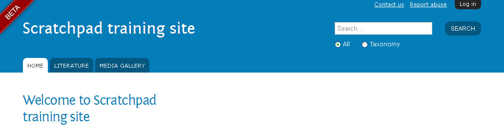
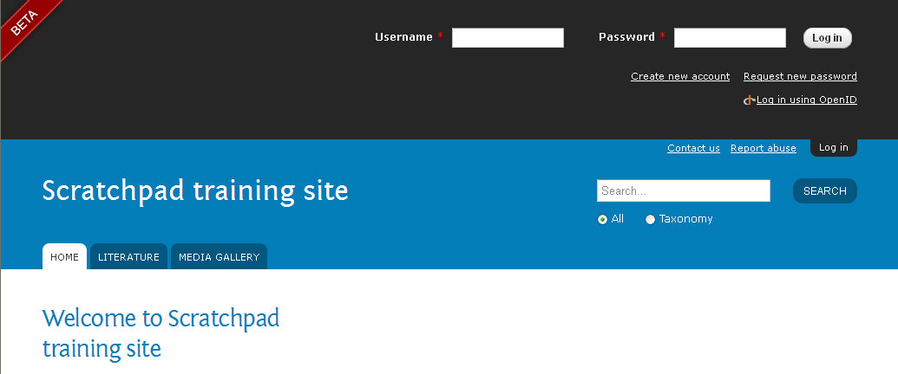

Logging in
==========

1. Go to the URL of your training site

2. The Log in button is in the upper right corner

3. Log in to your site with your username and password - the username for all training sites is:

|    **Username**: username
|    **Password**: password

4. Accept the terms & conditions and save

5. Click on the “Hello username” link in the upper corner of the site to go to your user account

6. Click on the Edit tab to edit your account data but do not alter your role or password

7. Save

.. image:: _static/useraccount.jpg